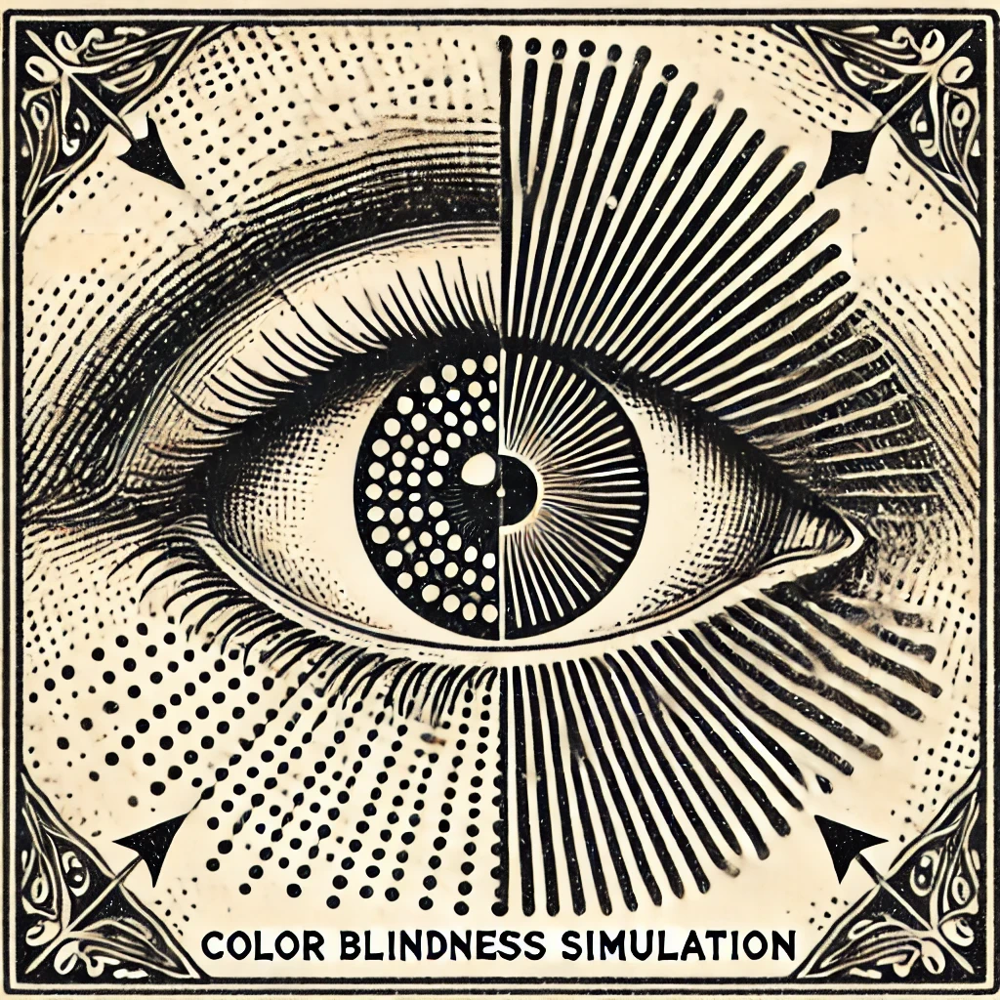

# Color Blindness Image Simulation


After conducting further research on colorblindness simulation, I highly recommend the [DaltonLens-Python](https://github.com/DaltonLens/DaltonLens-Python) repository. The [author's blog](https://daltonlens.org/#posts) is well worth reading.

## Requirements

1. cv2
2. numpy
3. matplotlib

## Repository Structure

```
.
├── data                                 # Contains the input images
├── results                              # Contains the output images
├── rendering.py                         # Color blindness image simulation
└── README.md
```

## Rendering Result
The sample image is cropped from the screenshot of the [*paper*](https://www.nature.com/articles/nmeth.1618)


Color-blind friendly version


#### Test the script:
- run *python rendering.py   --[image_path] --[output_path]*

## Disclaimer
The code in this project is revised based on [RGB2Colorblind](https://github.com/daijro/rgb2colorblind).

Please refer License Information of RGB2Colorblind.
